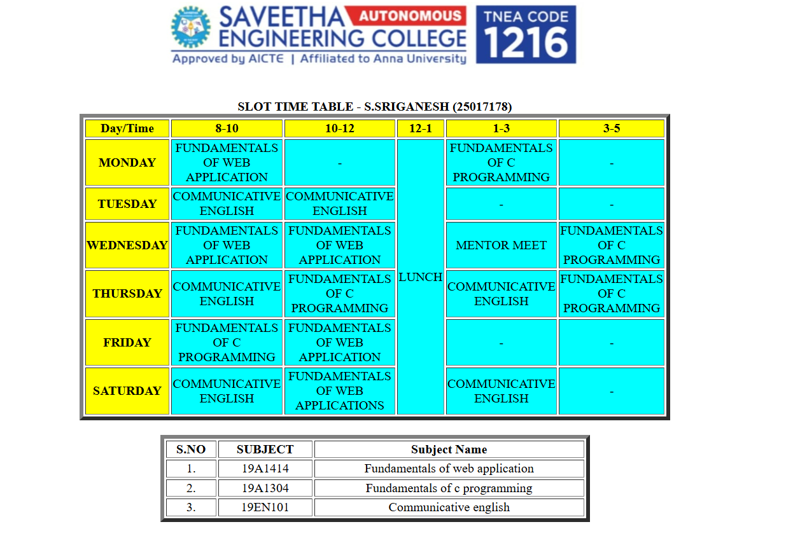

# Ex03 Time Table
# Date:24.09.2025
# AIM
To write a html webpage page to display your slot timetable.

# ALGORITHM
## STEP 1
Create a Django-admin Interface.

## STEP 2
Create a static folder and inert HTML code.

## STEP 3
Create a simple table using `<table>` tag in html.

## STEP 4
Add header row using `<th>` tag.

## STEP 5
Add your timetable using `<td>` tag.

## STEP 6
Execute the program using runserver command.

# PROGRAM
```
<!DOCTYPE html>
 <html>
    <head>
    <title>
        Slot Timetable
    </title>
    </head>
    <body>
        <center>
            
        </center>
        <br>
        <table align="center" width="540" cellspacing="3" cellspacing="4" border="5" bgcolor="white">
            <caption><b>SLOT TIME TABLE - S.SRIGANESH (25017178)</b></caption>
            <tr align="center">
            <th bgcolor="yellow">Day/Time</th>
            <th bgcolor="yellow">8-10</th>
            <th bgcolor="yellow">10-12</th>
            <th bgcolor="yellow">12-1</th>
            <th bgcolor="yellow">1-3</th>
            <th bgcolor="yellow">3-5</th>
            </tr>
            <tr align="center">
            <th bgcolor="yellow">MONDAY</th>
            <td bgcolor="cyan">FUNDAMENTALS OF WEB APPLICATION</td>
            <td bgcolor="cyan">-</td>
            <td rowspan="6" bgcolor="cyan">LUNCH</td>
            <td bgcolor="cyan">FUNDAMENTALS OF C PROGRAMMING</td>
            <td bgcolor="cyan">-</td>
            </tr>
            <tr align="center">
            <th bgcolor="yellow">TUESDAY</th>
            <td bgcolor="cyan">COMMUNICATIVE ENGLISH</td>
            <td bgcolor="cyan">COMMUNICATIVE ENGLISH</td>
            <td bgcolor="cyan">-</td>
            <td bgcolor="cyan">-</td>
            </tr>
            <tr align="center">
            <th bgcolor="yellow">WEDNESDAY</th>
            <td bgcolor="cyan">FUNDAMENTALS OF WEB APPLICATION</td>
            <td bgcolor="cyan">FUNDAMENTALS OF WEB APPLICATION</td>
            <td bgcolor="cyan">MENTOR MEET</td>
            <td bgcolor="cyan">FUNDAMENTALS OF C PROGRAMMING</td>
            </tr>
            <tr align="center">
            <th bgcolor="yellow">THURSDAY</th>
            <td bgcolor="cyan">COMMUNICATIVE ENGLISH</td>
            <td bgcolor="cyan">FUNDAMENTALS OF C PROGRAMMING</td>
            <td bgcolor="cyan">COMMUNICATIVE ENGLISH</td>
            <td bgcolor="cyan">FUNDAMENTALS OF C PROGRAMMING</td>
            </tr>
            <tr align="center">
            <th bgcolor="yellow">FRIDAY</th>
            <td bgcolor="cyan">FUNDAMENTALS OF C PROGRAMMING</td>
            <td bgcolor="cyan">FUNDAMENTALS OF WEB APPLICATION</td>
            <td bgcolor="cyan">-</td>
            <td bgcolor="cyan">-</td>
            </tr>
            <tr align="center">
            <th bgcolor="yellow">SATURDAY</th>
            <td bgcolor="cyan">COMMUNICATIVE ENGLISH</td>
            <td bgcolor="cyan">FUNDAMENTALS OF WEB APPLICATIONS</td>
            <td bgcolor="cyan">COMMUNICATIVE ENGLISH</td>
            <td bgcolor="cyan">-</td>
            </tr>
        </table>
        <br>
        <table align="center" width="540" cellspacing="3" cellspacing="4" border="5" bgcolor="white">
            <tr align="center">
            <th>S.NO</th>
            <th>SUBJECT </th>
            <th>Subject Name</th>
            </tr>
            <tr align="center">
            <td>1.</td>
            <td>19A1414</td>
            <td>Fundamentals of web application</td>
            </tr>
            <tr align="center">
            <td>2.</td>
            <td>19A1304</td>
            <td>Fundamentals of c programming</td>
            </tr>
            <tr align="center">
            <td>3.</td>
            <td>19EN101</td>
            <td>Communicative english</td>
            </tr>
    </body>
 </html>
 ```
# OUTPUT

# RESULT
The program for creating slot timetable using basic HTML tags is executed successfully.
